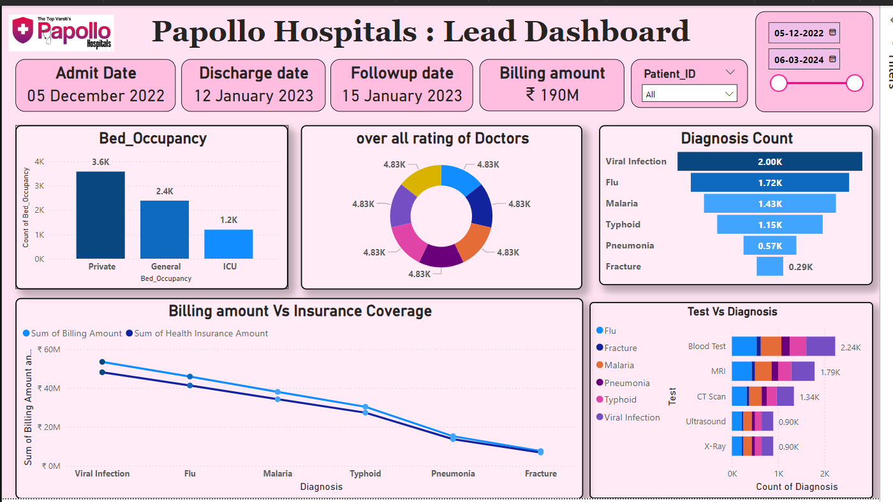

# Papollo-Hospitals-Lead-Dashboard

This dashboard for Papollo Hospitals provides a comprehensive analysis of key hospital metrics, facilitating informed decision-making and performance monitoring.

#### Bed Occupancy:
- **Private**: 3.6K beds occupied
- **General**: 2.4K beds occupied
- **ICU**: 1.2K beds occupied

#### Overall Rating of Doctors:
- The donut chart shows a consistent rating with equal segments, each representing a rating of 4.83K. This indicates uniformly high performance and satisfaction levels among doctors.

#### Diagnosis Count:
- **Viral Infection**: 2.00K cases
- **Flu**: 1.72K cases
- **Malaria**: 1.43K cases
- **Typhoid**: 1.15K cases
- **Pneumonia**: 0.57K cases
- **Fracture**: 0.29K cases

#### Billing Amount vs. Insurance Coverage:
- **Viral Infection**: ~₹50M billing amount, ~₹45M insurance coverage
- **Flu**: ~₹45M billing amount, ~₹40M insurance coverage
- **Malaria**: ~₹40M billing amount, ~₹35M insurance coverage
- **Typhoid**: ~₹35M billing amount, ~₹30M insurance coverage
- **Pneumonia**: ~₹30M billing amount, ~₹25M insurance coverage
- **Fracture**: ~₹20M billing amount, ~₹15M insurance coverage

#### Test vs. Diagnosis:
- **Blood Test**: 2.24K diagnoses
- **MRI**: 1.79K diagnoses
- **CT Scan**: 1.34K diagnoses
- **Ultrasound**: 0.90K diagnoses
- **X-Ray**: 0.90K diagnoses

### Insights:
- **High Occupancy Rates**: The high number of occupied private, general, and ICU beds indicates robust hospital utilization.
- **Doctor Ratings**: Consistently high doctor ratings reflect excellent patient satisfaction and healthcare quality.
- **Common Diagnoses**: Viral infections, flu, and malaria are the most common diagnoses, guiding resource allocation and preparedness.
- **Financials**: The comparison of billing amounts to insurance coverage reveals significant gaps, particularly in viral infections and fractures, which may indicate a need for better insurance policies or cost management.
- **Diagnostic Tests**: Blood tests are the most common diagnostic tool, followed by MRI and CT scans, highlighting areas for potential investment in diagnostic technology.

This dashboard is a vital tool for hospital administrators and healthcare professionals, offering clear visualizations and insights to enhance hospital operations and patient care.

